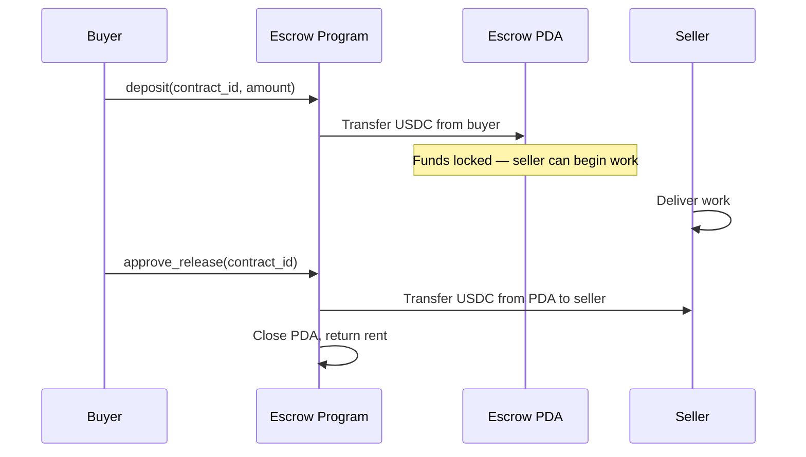
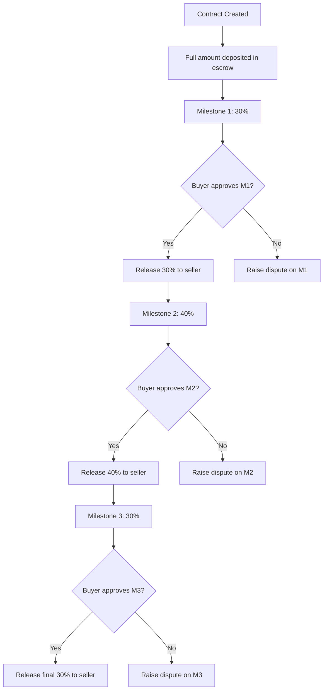
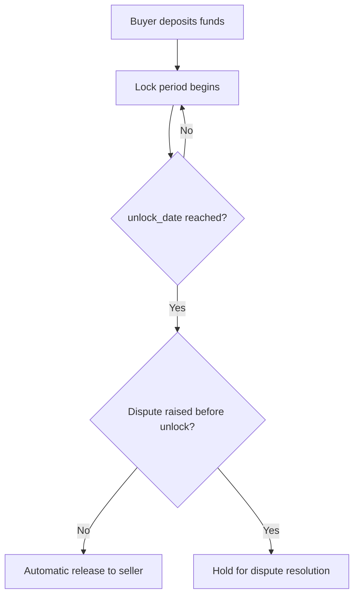
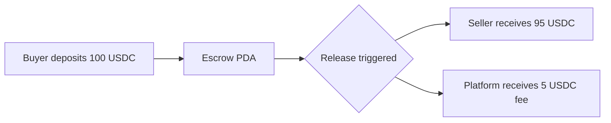
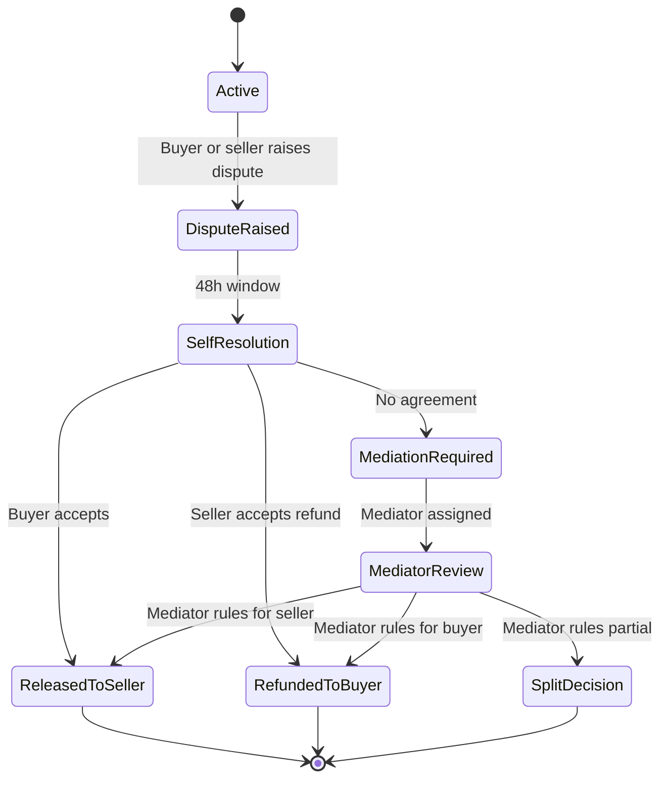

# Escrow Systems

On-chain escrow architecture for conditional payments, milestone-based releases, and dispute resolution on Solana using stablecoins.

---

## Escrow Fundamentals on Solana

On Solana, escrow is implemented via Program Derived Addresses (PDAs) that hold funds under your program's authority. No third party custodian is needed — the program's logic defines the release conditions.

**Core primitive:**
```
Escrow PDA = programId + seeds [
  "escrow",
  contract_id (bytes),
  token_mint (USDC mint)
]
```

The PDA is a token account whose authority is your escrow program. No private key can sign for it — only your program's logic can release funds.

---

## Escrow Architecture Patterns

### Pattern 1: Simple Two-Party Escrow

Buyer deposits funds. Seller provides service. Buyer confirms. Funds release.



**Use case**: Freelance work, simple service agreements, one-off purchases with delivery risk.

---

### Pattern 2: Milestone-Based Escrow

Large contracts split into multiple milestones, each with its own release condition.



**Data model:**

```
escrow_contracts {
  id:              UUID
  contract_type:   enum [simple, milestone, conditional]
  buyer_address:   solana address
  seller_address:  solana address
  escrow_pda:      solana address
  total_amount:    decimal
  token_mint:      string
  status:          enum [created, funded, in_progress, completed, disputed, canceled, refunded]
  dispute_id:      reference nullable
  release_conditions: jsonb
  funded_at:       timestamp nullable
  completed_at:    timestamp nullable
  expiry_date:     timestamp nullable
  created_at:      timestamp
}

escrow_milestones {
  id:               UUID
  contract_id:      reference to escrow_contracts
  sequence:         integer
  description:      text
  amount:           decimal
  percentage:       decimal
  status:           enum [pending, in_review, approved, disputed, released]
  submitted_at:     timestamp nullable
  approved_at:      timestamp nullable
  tx_signature:     string nullable
}
```

---

### Pattern 3: Time-Locked Escrow

Funds are locked until a specific date, then release automatically.



**Implementation note**: Solana does not natively enforce time locks in the token program. You must implement the time check in your escrow program's release instruction and read the Solana `Clock` sysvar for the current timestamp.

---

### Pattern 4: Multi-Party Escrow (Platform Marketplace)

Three-party: buyer, seller, platform. Platform takes a fee on release.



**Fee on release**: Deduct platform fee at the time of release within the escrow program instruction. Do not attempt to collect fees as a separate transaction — atomicity is critical.

---

## Dispute Resolution Architecture

Disputes are inevitable. Your system must define a clear escalation path before you launch.

### Dispute Tiers

| Tier | Trigger | Resolution | Authority |
|---|---|---|---|
| Self-resolution | Either party flags issue | 48h for parties to agree | Buyer + Seller |
| Mediation | No agreement in 48h | Platform mediator reviews evidence | Platform mediator |
| Arbitration | No agreement after mediation | Final binding decision | Platform arbitrator |

### Dispute Flow



### Dispute Data Model

```
disputes {
  id:              UUID
  contract_id:     reference to escrow_contracts
  milestone_id:    reference to escrow_milestones nullable
  raised_by:       enum [buyer, seller]
  reason:          text
  evidence_urls:   jsonb array (S3 links to uploaded files)
  status:          enum [open, mediating, resolved, escalated]
  resolution:      enum [released_to_seller, refunded_to_buyer, split] nullable
  split_seller_amount: decimal nullable
  split_buyer_amount:  decimal nullable
  mediator_id:     reference to users nullable
  resolution_note: text nullable
  opened_at:       timestamp
  resolved_at:     timestamp nullable
  resolution_tx_signatures: jsonb nullable
}
```

### Escrow Program Authority for Disputes

Your escrow program needs a dispute resolution authority — a special signer that can force-release or force-refund funds when the standard approval flow is blocked.

**Recommended**: Use a Squads 2/3 multisig as the dispute authority. This means your dispute arbitrators cannot act alone — at least two authorized team members must agree on the resolution before the program executes it.

```
Dispute Authority = Squads 2/3 multisig {
  Signer 1: Head of Trust & Safety
  Signer 2: Legal Counsel / Operations Lead
  Signer 3: CEO (tie-breaker)
}
```

---

## Escrow Expiry and Auto-Release

Every escrow should have an expiry date. If neither party acts by expiry:

- **Option A: Auto-refund** — Default to refunding the buyer after expiry
- **Option B: Auto-release** — Default to releasing to seller after expiry (if seller has delivered)
- **Option C: Hold** — Escrow remains locked until manual resolution (not recommended — creates operational burden)

Define your expiry policy per contract type:
- Simple escrow: 90-day expiry, auto-refund default
- Milestone escrow: 180-day expiry (longer projects), mediation required before expiry action
- Time-locked: No expiry — the lock date IS the release trigger

**Implement expiry in your off-chain monitoring service**, not in the Solana program (program-side cron doesn't exist). Your backend job monitors expiries and triggers the escrow program's expiry instruction.

---

## Escrow Security Considerations

### PDA Authority Security

- Your escrow program must verify that only authorized instructions can release funds
- Validate buyer and seller addresses are stored in the escrow account — do not accept them as instruction parameters (re-entrancy/spoofing risk)
- Validate the token mint matches what was deposited — do not allow substituting a different token on release

### Frozen Token Account Risk

USDC and PYUSD have freeze authority. If Circle or PayPal freezes the escrow PDA's token account, funds become inaccessible. This is an edge case but requires a recovery plan:
- Document your dispute with the issuer (Circle/PayPal) to unfreeze the account
- For high-value escrows, consult legal counsel on freeze risk and include contractual provisions

### Rent Consideration

Every on-chain account requires SOL for rent. Your escrow program opens PDAs — those PDAs need SOL for rent exemption.

- At current rates, a token account requires ~0.002 SOL for rent exemption
- Either the buyer funds this as part of the deposit transaction, or your platform pre-funds PDAs
- Close PDAs on escrow completion to recover rent SOL

See `security.md` for program security patterns and `settlement-systems.md` for how escrow releases integrate with your settlement pipeline.
