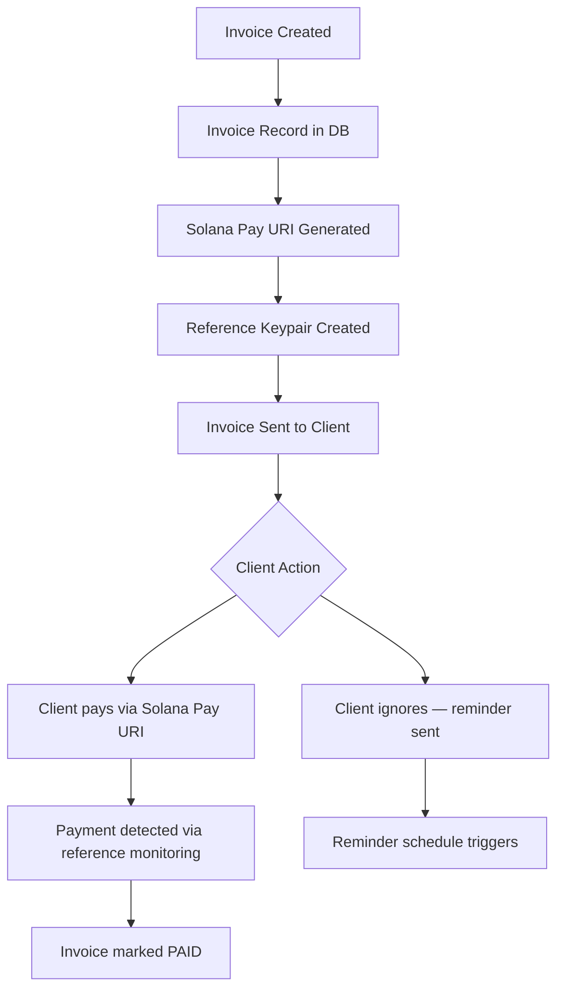
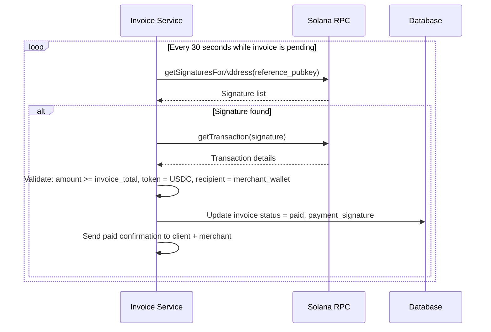
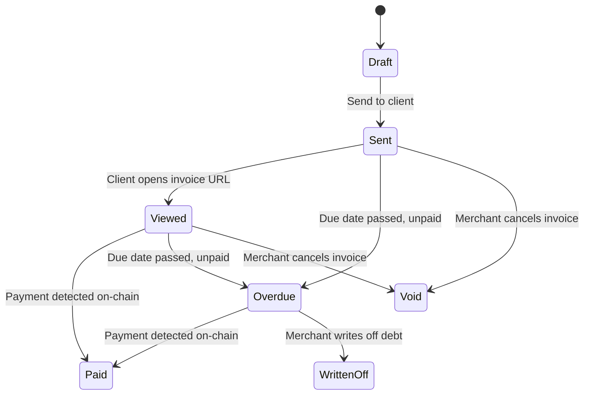

# Invoicing

Invoice generation, payment request architecture, and B2B billing workflows for stablecoin payments on Solana.

---

## Invoice Architecture Overview

Invoices on Solana are anchored payment requests: a document stating an amount owed, linked to a Solana Pay payment request that lets the recipient pay directly on-chain.



---

## Invoice Data Model

```
invoices {
  id:                UUID primary key
  invoice_number:    string unique (e.g., INV-2026-0042)
  merchant_id:       reference to merchants
  client_id:         reference to clients
  status:            enum [draft, sent, viewed, paid, overdue, void, written_off]
  line_items:        jsonb array
  subtotal:          decimal
  tax_amount:        decimal
  tax_rate:          decimal
  discount_amount:   decimal
  total_amount:      decimal
  currency:          enum [USDC, PYUSD, EURC]
  token_mint:        string (stablecoin mint address)
  reference_pubkey:  string unique (Solana Pay reference)
  payment_signature: string nullable (on-chain tx when paid)
  due_date:          date
  issued_date:       date
  paid_at:           timestamp nullable
  notes:             text nullable
  terms:             text nullable (e.g., "Net 30")
  pdf_url:           string nullable
  view_url:          string (public URL for client to view/pay)
  reminder_count:    integer default 0
  last_reminder_at:  timestamp nullable
  created_at:        timestamp
  updated_at:        timestamp
}

invoice_line_items {
  id:            UUID
  invoice_id:    reference to invoices
  description:   string
  quantity:      decimal
  unit_price:    decimal
  amount:        decimal
  tax_exempt:    boolean default false
}

clients {
  id:              UUID
  merchant_id:     reference to merchants
  company_name:    string
  contact_name:    string
  email:           string
  solana_address:  string nullable (their preferred payment wallet)
  payment_terms:   string (e.g., "Net 30")
  currency:        enum [USDC, PYUSD, EURC]
  created_at:      timestamp
}
```

---

## Invoice Number Generation

Invoice numbers must be unique, sequential, and human-readable. Do not use UUIDs as invoice numbers.

### Recommended Format

```
{PREFIX}-{YEAR}-{SEQUENCE}

Examples:
  INV-2026-0001
  INV-2026-0042
  PRO-2026-0007  (for Pro-forma invoices)
  CRD-2026-0003  (for Credit notes)
```

**Sequence implementation**: Store the last sequence number per merchant per year in your database. Use a database-level atomic increment (e.g., PostgreSQL `SERIAL` or `SELECT ... FOR UPDATE`) to avoid duplicate numbers under concurrent requests.

---

## Invoice Payment Flow

### Solana Pay Invoice Link

For each invoice, generate a Solana Pay transfer request URI:

```
solana:<merchant_receiving_wallet>
  ?amount=<invoice_total>
  &spl-token=<USDC_mint>
  &reference=<reference_pubkey>
  &label=<merchant_name>
  &message=Invoice+<invoice_number>
  &memo=<invoice_id>
```

Embed this URI as a QR code and a clickable button on the invoice page.

### Invoice Payment Detection



**Polling vs. Webhooks:**
- For high-volume invoice platforms: use Helius Webhooks, monitor reference addresses via webhook subscriptions
- For low-volume or simple implementations: polling every 30 seconds is acceptable
- Never poll faster than 10 seconds per invoice — unnecessary RPC load

### Overpayment and Underpayment Handling

| Scenario | Detection | Handling |
|---|---|---|
| Exact payment | amount == invoice_total | Mark as paid — normal flow |
| Overpayment (client paid more) | amount > invoice_total | Mark as paid, log overpayment, notify merchant to refund delta |
| Underpayment (client paid less) | amount < invoice_total (within 1%) | Mark as paid with note (tolerance for rounding) |
| Significant underpayment | amount < invoice_total - 1% | Mark as partial payment, notify client of remaining balance |
| Wrong token | token_mint != expected_mint | Do NOT mark as paid; alert merchant; issue manual resolution |

---

## Invoice Lifecycle and Reminders



### Reminder Schedule

```
Day 0:    Invoice sent
Day -3:   Reminder: "Invoice due in 3 days" (if not yet paid)
Day 0:    Reminder: "Invoice due today"
Day +1:   Reminder: "Invoice 1 day overdue"
Day +7:   Reminder: "Invoice 7 days overdue — urgent"
Day +14:  Reminder: "Final notice before collections"
```

Implement reminders as a background job that runs daily, queries overdue invoices, and sends emails.

---

## Credit Notes

Credit notes are the mechanism for issuing partial or full refunds against a paid invoice.

```
credit_notes {
  id:              UUID
  credit_note_number: string unique (e.g., CRD-2026-0003)
  invoice_id:      reference to invoices
  merchant_id:     reference to merchants
  amount:          decimal
  reason:          string
  status:          enum [draft, issued, processed]
  tx_signature:    string nullable (on-chain refund tx)
  issued_at:       timestamp
  processed_at:    timestamp nullable
}
```

Credit notes do not automatically trigger on-chain transactions. The merchant must explicitly approve and execute the refund transfer.

---

## Recurring Invoice Architecture

For clients billed on a regular schedule (e.g., monthly retainer), use recurring invoice templates.

```
invoice_templates {
  id:              UUID
  merchant_id:     reference to merchants
  client_id:       reference to clients
  frequency:       enum [weekly, monthly, quarterly, annually]
  next_issue_date: date
  auto_send:       boolean
  line_items:      jsonb (same structure as invoice line_items)
  payment_terms:   string
  currency:        enum [USDC, PYUSD, EURC]
  active:          boolean
}
```

The recurring invoice job:
1. Runs daily at midnight UTC
2. Queries templates where `next_issue_date = today AND active = true`
3. Creates a new invoice from the template
4. If `auto_send = true`, sends immediately; otherwise, creates as draft for merchant review
5. Updates `next_issue_date` to the next occurrence

---

## B2B Invoice Considerations

### NET Terms

B2B invoices commonly use NET 30, NET 60, or NET 90 terms. This is the number of days from invoice date the client has to pay.

```
due_date = issued_date + payment_terms_days

NET 30: due_date = issued_date + 30 days
NET 60: due_date = issued_date + 60 days
```

### Early Payment Discounts

Incentivize early payment with a discount:

```
"2/10 NET 30" = 2% discount if paid within 10 days, otherwise full amount due within 30 days

Implementation:
  if payment_date <= issued_date + 10 days:
    accepted_amount = invoice_total × 0.98
  else:
    accepted_amount = invoice_total
```

Store the early payment window and discount rate on the invoice. Check which threshold applies when validating on-chain payment.

### Multi-Currency B2B Invoicing

For B2B clients who prefer EURC while your platform settles in USDC:
- Issue the invoice in the client's preferred currency (EURC)
- On receipt, convert to USDC at market rate via a DEX (Jupiter) or hold as EURC in treasury
- Document the exchange rate in your settlement records
- Communicate the conversion policy to merchants and clients in advance

See `payment-links.md` for shareable payment link architecture and `settlement-systems.md` for how invoice payments settle.
