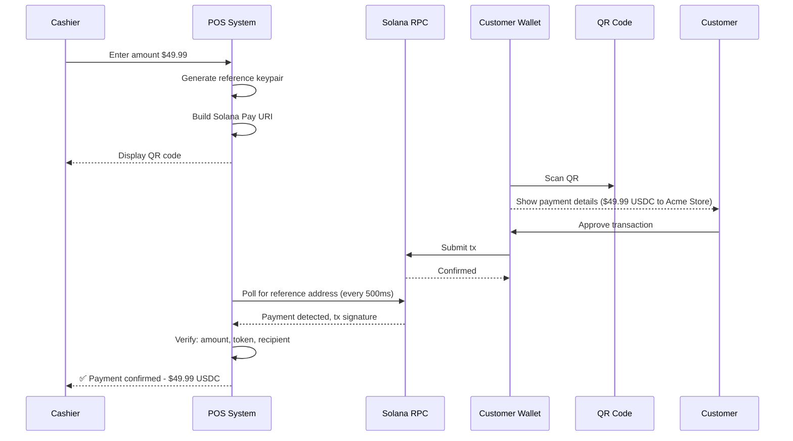
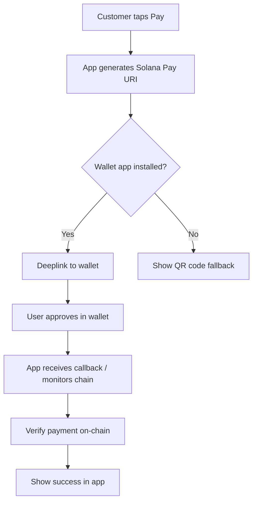
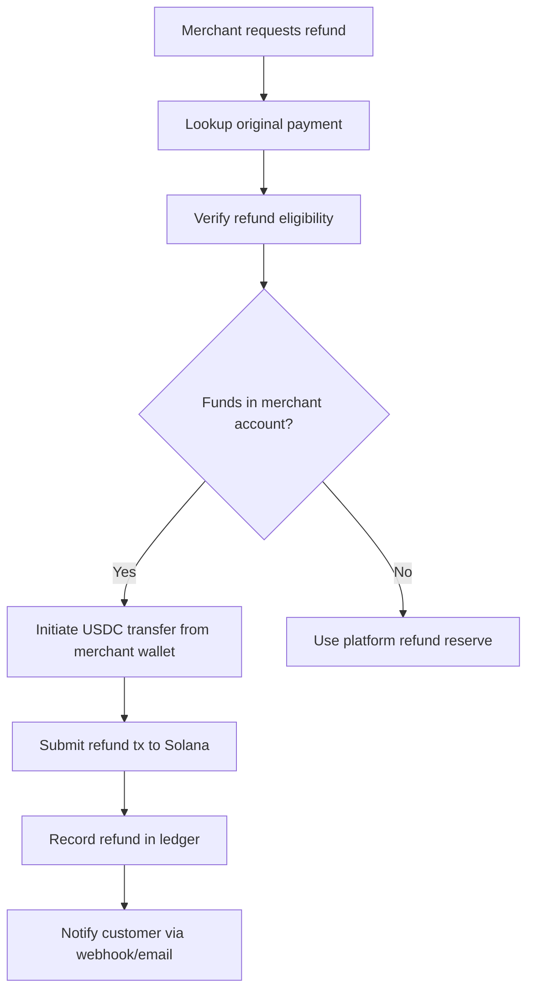

# Merchant Checkout

Checkout architecture for stablecoin payments on Solana. Covers Solana Pay, QR codes, web checkout, mobile checkout, and merchant API design.

---

## Checkout Method Selection

Choose the checkout method based on your merchant's use case:

| Method | Best For | UX | Technical Complexity |
|---|---|---|---|
| Solana Pay QR | Physical retail, events, in-person | Best for mobile | Low |
| Solana Pay URL | Web checkout redirect | Good | Low |
| Custom Web Checkout | Embedded checkout widget | Best for web | Medium |
| Invoice Link | B2B, freelance, professional services | Good | Low |
| Payment API | Platform integrations, custom flows | Developer-facing | High |
| Mobile SDK | Native iOS/Android apps | Best for mobile | Medium-High |

---

## Solana Pay Integration

### How Solana Pay Works

Solana Pay is an open protocol that defines a URI format for payment requests. Any Solana wallet that supports the protocol can parse the URI and prompt the user to approve the transaction.

**Transfer Request URI (Simple)**
```
solana:<recipient>?amount=<amount>&spl-token=<mint>&reference=<reference>&label=<label>&message=<message>&memo=<memo>
```

**Real USDC Payment Example**
```
solana:7vFLBhYqZFqDzNwJJtVNXdJxAKBaWXaJfxFrKBRqLm2P
  ?amount=49.99
  &spl-token=EPjFWdd5AufqSSqeM2qN1xzybapC8G4wEGGkZwyTDt1v
  &reference=8xKRtJBqVnQYpVCzCWBkL9oqNPLmDJbhN7iH4wRaFc5
  &label=Acme+Store
  &message=Order+%23A1234
  &memo=order_a1234
```

**Fields Explained:**
- `recipient`: Your merchant receiving wallet address
- `amount`: Exact USDC amount (decimal, not lamports)
- `spl-token`: The token mint. USDC = `EPjFWdd5AufqSSqeM2qN1xzybapC8G4wEGGkZwyTDt1v`
- `reference`: A unique keypair public key generated per-checkout. You monitor this to detect payment.
- `label`: Displayed to the user in their wallet as the merchant name
- `message`: Human-readable description shown in wallet
- `memo`: On-chain memo, useful for reconciliation

**PYUSD Mint:** `2b1kV6DkPAnxd5ixfnxCpjxmKwqjjaYmCZfHsFu24GXo`
**EURC Mint:** `HzwqbKZw8HxMN6bF2yFZNrht3c2iXXzpKcFu7uBEDKtr`

---

### QR Code Checkout Flow



**Reference Key Lifecycle:**
1. Generate a fresh `Keypair` per checkout — never reuse
2. Include the public key as `&reference=<publicKey>` in the URI
3. Poll `getSignaturesForAddress(referencePublicKey)` on Solana
4. When a signature appears, fetch and verify the full transaction
5. Mark checkout as paid only after verification

**Confirmation Timing:**
- Solana finalizes transactions in ~400ms-2.5s under normal conditions
- Use `commitment: "confirmed"` for checkout (fast)
- Use `commitment: "finalized"` for high-value settlements (slower but final)
- Display a loading state; do not assume instant payment

---

### Web Checkout Integration

For web-based checkout, you have two patterns:

**Pattern A: Wallet Adapter (Non-custodial)**

The customer connects their Solana wallet (Phantom, Backpack, Solflare) directly in the browser and approves the transaction.

```mermaid
graph LR
    A[Customer visits checkout] --> B[Connect wallet button]
    B --> C[Wallet adapter popup]
    C --> D[Wallet connected]
    D --> E[Build transaction in frontend]
    E --> F[Request wallet signature]
    F --> G[Submit tx to RPC]
    G --> H[Your API verifies on-chain]
    H --> I[Order confirmed]
```



**Tradeoffs:**
- ✅ Non-custodial — you never hold private keys
- ✅ Best UX for crypto-native users
- ❌ Requires customer to have a Solana wallet
- ❌ Not accessible to crypto beginners

**Pattern B: Payment Link Redirect (Solana Pay URL)**

Generate a Solana Pay URL and redirect the customer to it. Wallets on mobile handle the deeplink.

```
https://yoursite.com/pay?uri=solana:...
```

On mobile, this deeplinks into the user's wallet app. On desktop, display a QR code.

---

### Mobile Checkout

For mobile apps (iOS/Android), implement Solana Pay URL deeplinks and handle the callback.

**Mobile Payment Flow:**


**App-to-App Communication:**
- Use `solana://` deeplink scheme for Phantom
- Use universal links for iOS (avoid App Store review issues)
- Always implement a QR fallback for when no wallet is installed
- Monitor the reference address independently — do not trust the callback

---

## Checkout Session Architecture

Never create a payment without a checkout session. A checkout session is a server-side record that anchors the payment to a business intent.

### Checkout Session Schema

```
checkout_sessions {
  id:                 UUID primary key
  merchant_id:        reference to merchant
  reference_pubkey:   unique, the Solana Pay reference key
  amount:             decimal (e.g., 49.99)
  token_mint:         string (USDC/PYUSD/EURC mint)
  currency:           enum [USDC, PYUSD, EURC]
  status:             enum [pending, paid, expired, refunded]
  payment_signature:  nullable string (filled on payment)
  expires_at:         timestamp (session TTL, e.g., 15 minutes)
  metadata:           jsonb (cart data, order ID, customer ID)
  created_at:         timestamp
  paid_at:            timestamp nullable
}
```

### Session Expiry

- Set a TTL of 10–15 minutes for retail checkout
- Set 24–72 hours for invoice-style checkouts
- Expire sessions server-side — do not rely on frontend countdown
- A payment that arrives after session expiry needs manual review (the money arrived but your system expired the session)

**Handle late payments:** Keep a grace window (2-3 minutes past expiry) to catch payments that were initiated before expiry but confirmed after. Log these for manual review.

---

## Multi-Currency Checkout

If you support USDC, PYUSD, and EURC, you need to handle:

### Currency Selection UX

Present the customer with a token selector before generating the payment request. Do not attempt to auto-detect which token they hold.

### Amount Equivalence

If your pricing is in USD:
- USDC amount = USD amount (1:1)
- PYUSD amount = USD amount (1:1)
- EURC amount = USD amount ÷ EUR/USD exchange rate

For EURC, use the Pyth Network `EUR/USD` price feed to get the exchange rate. Lock the rate for the duration of the checkout session. Include the rate and the rate timestamp in your checkout session record.

### Stablecoin Considerations

| Factor | USDC | PYUSD | EURC |
|---|---|---|---|
| Liquidity on Solana | Very high | Medium | Low-Medium |
| Wallet support | Universal | Growing | Limited |
| Depegging risk | Very low | Low | Very low |
| Freeze authority | Yes (Circle) | Yes (PayPal) | Yes (Circle) |
| Redemption | Circle APIs | PayPal | Circle APIs |

---

## Merchant API Design

For platforms that need to expose checkout to other developers, design a clean merchant API.

### Core Endpoints

```
POST   /v1/checkout/sessions        Create a checkout session
GET    /v1/checkout/sessions/:id    Get session status
POST   /v1/checkout/sessions/:id/expire  Expire a session early
GET    /v1/payments                 List payments
GET    /v1/payments/:signature      Get payment details
POST   /v1/refunds                  Initiate a refund
GET    /v1/webhooks                 List configured webhooks
POST   /v1/webhooks                 Register a webhook endpoint
```

### Idempotency

Every `POST` endpoint must support an `Idempotency-Key` header. This prevents duplicate charges if a client retries a request due to a network error. Store idempotency keys for 24 hours minimum.

### Webhook Events

```
payment.created       — Checkout session initiated
payment.confirmed     — On-chain payment detected and verified
payment.expired       — Checkout session expired without payment
payment.refunded      — Refund transaction confirmed on-chain
settlement.completed  — Merchant payout settled
```

---

## Refund Architecture

Solana does not have native refund mechanics. Refunds are a new USDC transfer from your wallet to the customer.

### Refund Flow



### Refund Considerations

- Full refunds are straightforward: send back the original amount
- Partial refunds require amount calculation and clear logging
- If the merchant's balance was already swept to treasury, you need to fund refunds from a refund reserve wallet
- Record refunds as a separate ledger entry linked to the original payment (do not modify the original payment record)
- Solana transaction fees on refund transactions are paid by you, not the customer

See `settlement-systems.md` for payout and sweep architecture.
