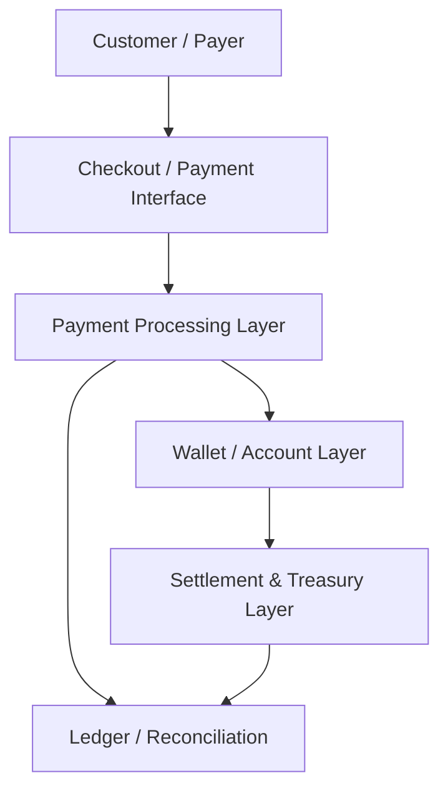
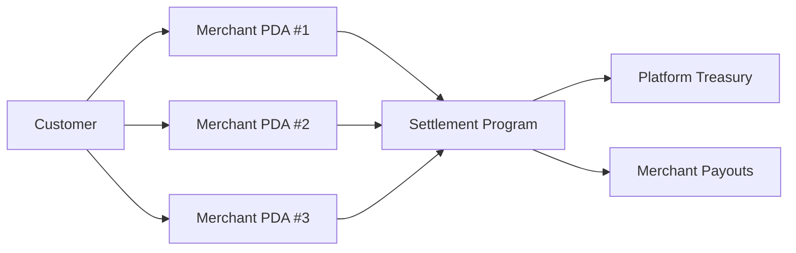
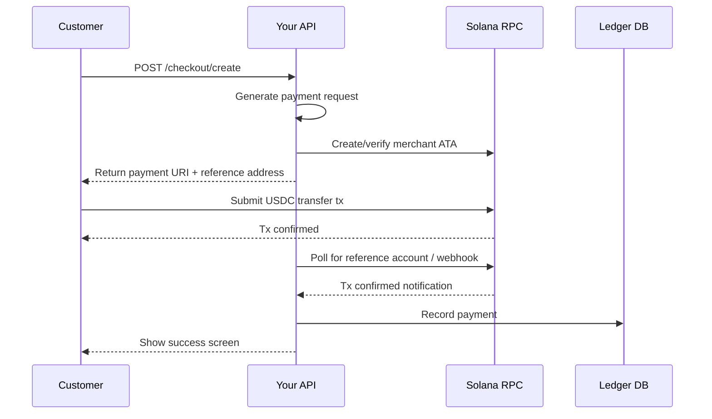
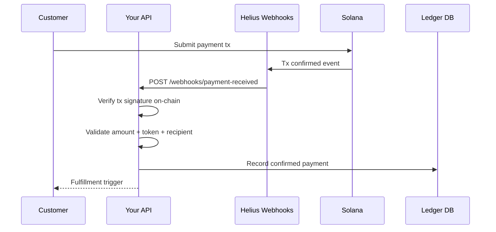
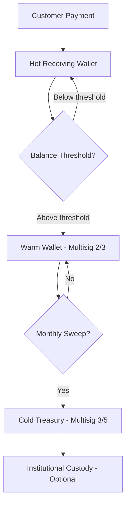
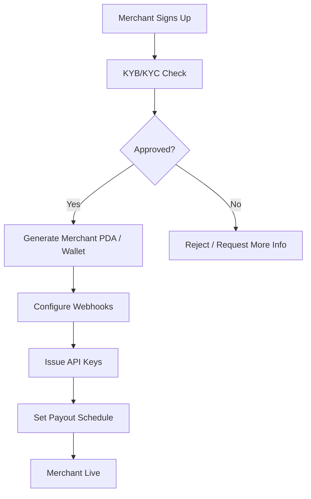

# Payment Architecture

Core architectural patterns for stablecoin payment systems on Solana. Use this module when designing a new payment system or when a user asks about overall payment architecture, wallet structures, or settlement pipelines.

---

## Architectural Foundation

Every stablecoin payment system on Solana has the same five structural layers, regardless of business type or volume:



**Layer 1: Interface** — Where the customer initiates payment (QR code, web, mobile, invoice link)
**Layer 2: Processing** — Payment request creation, status monitoring, confirmation handling
**Layer 3: Wallet / Accounts** — Merchant receiving wallets, staging accounts, vault accounts
**Layer 4: Settlement** — Fund movement to treasury, payouts to sellers, batch operations
**Layer 5: Ledger** — Your off-chain record of all transactions, essential for reconciliation and reporting

---

## Account Architecture Patterns

### Pattern 1: Shared Merchant Wallet (Simple, High Risk)

All merchants receive payments into a single hot wallet.

```
Customer → [Single Hot Wallet] → Treasury
```

| Attribute | Value |
|---|---|
| Complexity | Low |
| Security Risk | High (single point of failure) |
| Reconciliation | Requires memo/reference tracking |
| Best For | Single-merchant businesses only |
| Volume Ceiling | < $50K/month before risk becomes unacceptable |

**Do not use for multi-merchant platforms.**

---

### Pattern 2: Per-Merchant PDAs (Recommended for Marketplaces)

Each merchant gets a dedicated Program Derived Address (PDA) as their receiving account.

```
Customer → [Merchant PDA] → Settlement Program → Treasury
```



| Attribute | Value |
|---|---|
| Complexity | Medium |
| Security Risk | Low (isolated accounts) |
| Reconciliation | Native — each PDA maps to one merchant |
| Best For | Marketplaces, multi-merchant SaaS |
| Scalability | Effectively unlimited |

**PDA Derivation Pattern:**
```
seeds = [
  "merchant_account",
  merchant_id (bytes),
  currency_mint (USDC mint address)
]
program_id = your_payment_program
```

This gives every merchant a deterministic, isolated token account under your program's authority.

---

### Pattern 3: Custodial Wallet Per Merchant (Managed, Scalable)

Your backend generates and manages keypairs for each merchant. Funds land in managed wallets, swept on schedule.

```
Customer → [Managed Merchant Wallet] → Sweep Job → Treasury
```

| Attribute | Value |
|---|---|
| Complexity | High (key management required) |
| Security Risk | Medium (depends on key storage) |
| Reconciliation | Native — one wallet per merchant |
| Best For | Platforms that need full custody control |
| Key Management | HSM or MPC required at scale |

**Critical**: If you manage keys on behalf of users, evaluate whether you are operating as a money transmitter in your jurisdiction.

---

## Payment Flow Architecture

### Synchronous Payment Flow (Web/API)



**Key design note**: Never trust that a payment landed without independently verifying on-chain. Your API must monitor the Solana chain, not rely solely on what the customer's frontend tells you.

---

### Webhook-Driven Payment Flow (Production)

Use Helius Webhooks or QuickNode Streams to receive push notifications instead of polling.



**Security note**: Always re-verify every webhook payload against the Solana RPC. Webhook delivery can be spoofed or replayed. The chain is the source of truth.

---

## Wallet Topology

### Production Wallet Topology



| Wallet Type | Purpose | Signing | Balance Target |
|---|---|---|---|
| Hot Wallet | Receive payments, fund operations | 1-of-1 or 1-of-2 | 24-48h operating float |
| Warm Wallet | Accumulate settlements, fund payouts | 2-of-3 multisig | 7-30d float |
| Cold Treasury | Long-term reserves | 3-of-5 multisig | >30d reserves |
| Institutional | >$5M reserves | Fireblocks/Anchorage | Long-term holdings |

---

## Reconciliation Architecture

Reconciliation is not optional. Every payment system needs an off-chain ledger that can be reconciled against the on-chain state.

### Minimum Ledger Schema

```
payments {
  id:               UUID primary key
  merchant_id:      reference to merchants table
  solana_signature: unique, the on-chain tx signature
  reference:        unique identifier sent in payment request
  amount_lamports:  bigint (exact on-chain amount)
  amount_display:   decimal (human-readable, e.g. 49.99)
  token_mint:       USDC/PYUSD/EURC mint address
  payer_address:    source wallet
  recipient_address: receiving wallet
  status:           enum [pending, confirmed, failed, refunded]
  confirmed_at:     timestamp (when on-chain confirmation detected)
  settled_at:       timestamp (when funds moved to treasury)
  created_at:       timestamp
  metadata:         jsonb (product IDs, order IDs, etc.)
}
```

### Reconciliation Job

Run a daily reconciliation job that:
1. Queries all `confirmed` payments from the last 24h
2. Fetches corresponding on-chain transaction signatures from Solana
3. Validates: amount, token, recipient, timestamp
4. Flags any discrepancies for manual review
5. Generates a daily settlement report

---

## Merchant Onboarding Architecture



### Merchant Configuration Data Model

```
merchants {
  id:              UUID
  business_name:   string
  kyb_status:      enum [pending, approved, rejected, suspended]
  receiving_wallet: solana address (PDA or managed wallet)
  payout_wallet:   solana address (merchant controls this)
  payout_schedule: enum [daily, weekly, on_demand]
  payout_threshold: decimal (minimum balance to trigger payout)
  accepted_tokens: array [USDC, PYUSD, EURC]
  webhook_url:     url
  webhook_secret:  encrypted string
  fee_rate:        decimal (platform fee %)
  created_at:      timestamp
}
```

---

## Choosing Your Architecture

| Business Type | Recommended Pattern | Settlement | Treasury |
|---|---|---|---|
| Single-brand e-commerce | Shared hot wallet | Nightly sweep | 2/3 multisig |
| Marketplace (multi-seller) | Per-merchant PDA | Daily per-merchant | 3/5 multisig |
| SaaS subscription | Custodial managed wallets | Monthly billing cycle | 2/3 multisig |
| Freelance platform | Escrow PDA per contract | On milestone completion | 3/5 multisig |
| Payment processor | Per-customer custodial | Real-time or batched | Institutional custody |

See `merchant-checkout.md` for checkout flows, `treasury-management.md` for treasury design, and `settlement-systems.md` for settlement pipeline details.
