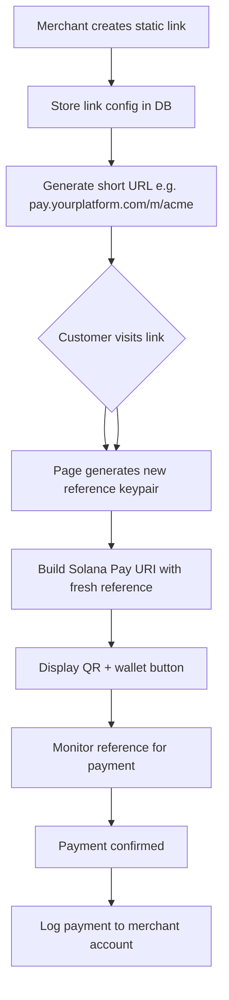
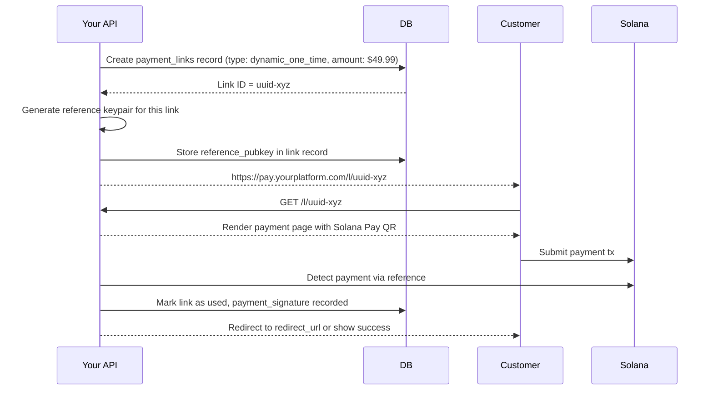

# Payment Links

Shareable payment link architecture for stablecoin payments on Solana. Covers static links, dynamic links, one-time use links, and checkout page design.

---

## Payment Link Types

| Type | Reusable | Fixed Amount | Use Case |
|---|---|---|---|
| Static payment link | Yes | No (payer enters amount) | Tips, donations, open-ended payments |
| Static fixed-amount link | Yes | Yes | Fixed-price products |
| Dynamic one-time link | No | Yes | Specific order or invoice |
| QR code link | Both | Both | Physical retail, events |
| API-generated link | No | Yes | Programmatic checkout |

---

## Static Payment Links

A static payment link is a permanent URL that generates a fresh Solana Pay request each time it is loaded. It is re-usable across unlimited payments.

### Architecture



**Key insight**: The URL is static but the reference keypair is generated fresh on each page load. This allows the same link to be used for multiple distinct payments, with each payment uniquely tracked.

### Static Link Schema

```
payment_links {
  id:               UUID
  merchant_id:      reference to merchants
  slug:             string unique (URL-safe, e.g., "acme-coffee")
  display_name:     string (shown to payer)
  description:      text nullable
  link_type:        enum [static_open, static_fixed, dynamic_one_time]
  fixed_amount:     decimal nullable
  token_mint:       string (USDC mint by default)
  currency:         enum [USDC, PYUSD, EURC]
  redirect_url:     string nullable (after successful payment)
  receiving_wallet: solana address
  metadata:         jsonb (custom fields: product_id, campaign, etc.)
  is_active:        boolean default true
  total_collected:  decimal default 0
  payment_count:    integer default 0
  created_at:       timestamp
  expires_at:       timestamp nullable
}
```

---

## Dynamic One-Time Payment Links

Generated per-transaction for a specific amount. Common for order confirmation emails, checkout redirects, and invoice payments.

### Generation Flow



**One-time use enforcement:**
- When a link is loaded, check `status = pending` before rendering
- After payment detected, set `status = paid`
- If a paid link is loaded again, show a "Already paid" page — do not render a new payment request

---

## Short URL Design

Payment links should be short, human-readable, and shareable.

### URL Structure

```
Static merchant link:    https://pay.yourplatform.com/m/{slug}
Dynamic one-time link:   https://pay.yourplatform.com/l/{id}
Invoice payment link:    https://pay.yourplatform.com/i/{invoice_id}
QR code image:           https://pay.yourplatform.com/qr/{link_id}.png
```

### Slug Requirements

- Lowercase alphanumeric + hyphens only
- 3-50 characters
- No profanity filter bypass (maintain a blocklist of reserved slugs)
- Must be unique across all merchants
- Reserved slugs: `admin`, `api`, `app`, `m`, `l`, `i`, `qr`, `pay`, `checkout`, `help`, `support`

---

## Payment Page Design Requirements

The payment page that customers see when they open a payment link must convey trust and clarity.

### Required Elements

```
┌─────────────────────────────────────┐
│  [Merchant Logo]                    │
│  Paying: Acme Store                 │
│  Amount: 49.99 USDC                 │
│  For: Premium Plan - Monthly        │
│                                     │
│  [QR Code — large, high contrast]   │
│                                     │
│  [Connect Wallet] button            │
│  [Pay $49.99 USDC with Phantom]     │
│                                     │
│  ⏱ Expires in 12:45               │
│                                     │
│  Secured by [Platform Name]         │
│  Powered by Solana                  │
└─────────────────────────────────────┘
```

### Wallet Auto-Detection

Use `@solana/wallet-adapter-react` to detect available wallets in the browser. Priority order:
1. Phantom (most common on Solana)
2. Backpack
3. Solflare
4. Any other detected wallet adapter

If no wallet detected: Show a "Get a Solana wallet" CTA alongside the QR code for mobile users.

---

## Payment Link Analytics

Track engagement to understand payment funnel conversion.

### Events to Track

```
payment_link_events {
  id:           UUID
  link_id:      reference to payment_links
  event_type:   enum [viewed, wallet_connected, payment_initiated, payment_confirmed, expired, error]
  ip_hash:      string (hashed for privacy)
  user_agent:   string
  wallet:       string nullable (wallet adapter name)
  metadata:     jsonb
  created_at:   timestamp
}
```

### Funnel Metrics

- **View rate**: How many times link was opened
- **Wallet connect rate**: % of views where wallet was connected
- **Completion rate**: % of views that resulted in confirmed payment
- **Time to pay**: Median seconds from page load to payment confirmation
- **Drop-off stage**: Where most users abandon (before connect vs. after connect)

---

## QR Code Generation

QR codes for payment links must be:
- High contrast (black on white, minimum)
- Error correction level: **M or H** (medium or high — allows the QR to be read even if partially obscured)
- Minimum printed size: 3cm × 3cm
- Logo overlay supported (up to 30% of QR surface before readability degrades)

**QR content**: Encode the full Solana Pay URI — not your short URL. This ensures wallets that deeplink directly from QR scan receive the complete payment request without an HTTP redirect.

### QR Code as an API

Expose a QR code endpoint for merchants:

```
GET /api/qr/{link_id}?format=png&size=512&logo=true

Response: image/png
```

Parameters:
- `format`: `png` (default), `svg`
- `size`: width in pixels (128, 256, 512, 1024)
- `logo`: include merchant logo in center (default: false)

---

## Embeddable Payment Button

For merchants who want to embed a pay button on their own website:

```html
<!-- Embed snippet provided to merchants -->
<script src="https://pay.yourplatform.com/embed.js"
        data-link-id="uuid-xyz"
        data-theme="dark"
        data-label="Pay with USDC">
</script>
```

The embed script renders a button that, when clicked, opens a payment modal or redirects to the payment page.

**Security requirements for embed:**
- The embed script must not expose API keys
- Content Security Policy headers must be set correctly for iframe embeds
- All payment processing happens on your domain, not the merchant's domain (prevents phishing/spoofing)

---

## Link Expiry and Lifecycle

| Link Type | Default Expiry | Behavior at Expiry |
|---|---|---|
| Static open | Never (unless merchant sets) | Remains active indefinitely |
| Static fixed | Never | Remains active |
| Dynamic one-time | 30 minutes | Page shows "link expired" |
| Invoice link | Invoice due date + 30 days | Page shows "invoice closed" |
| QR code (event) | Event end date | Page shows "event has ended" |

### Expired Link Handling

- Never show an error page — explain what happened clearly
- Provide a merchant contact option ("Contact the merchant if you believe this is an error")
- If the merchant has a redirect URL set, redirect there after showing a brief expiry message

See `invoicing.md` for invoice-specific payment links and `merchant-checkout.md` for embedded checkout flows.
