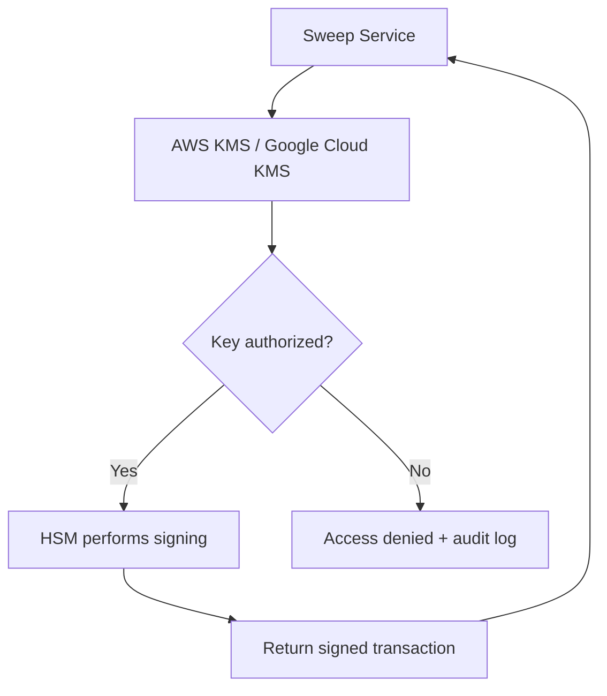
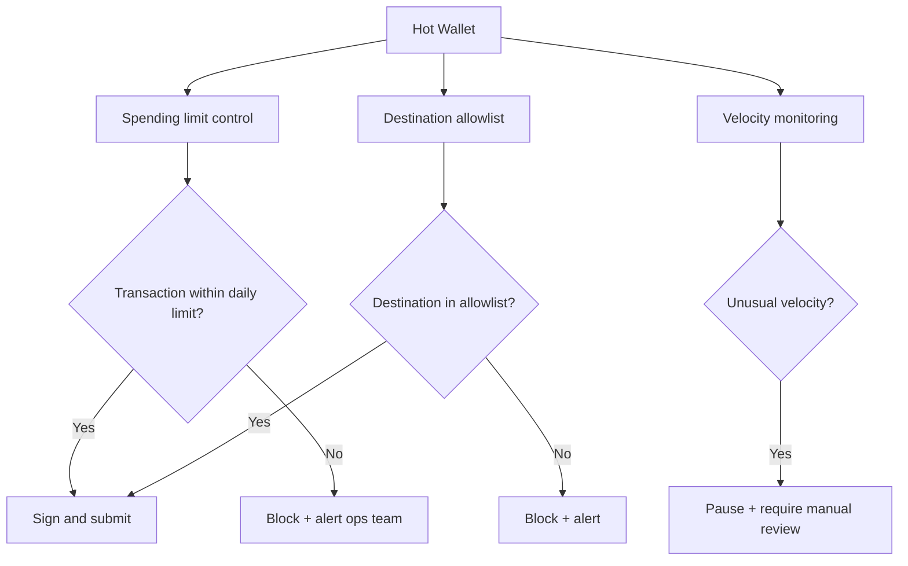
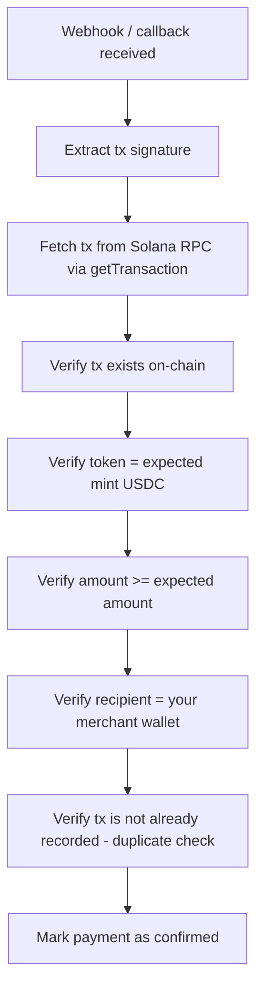
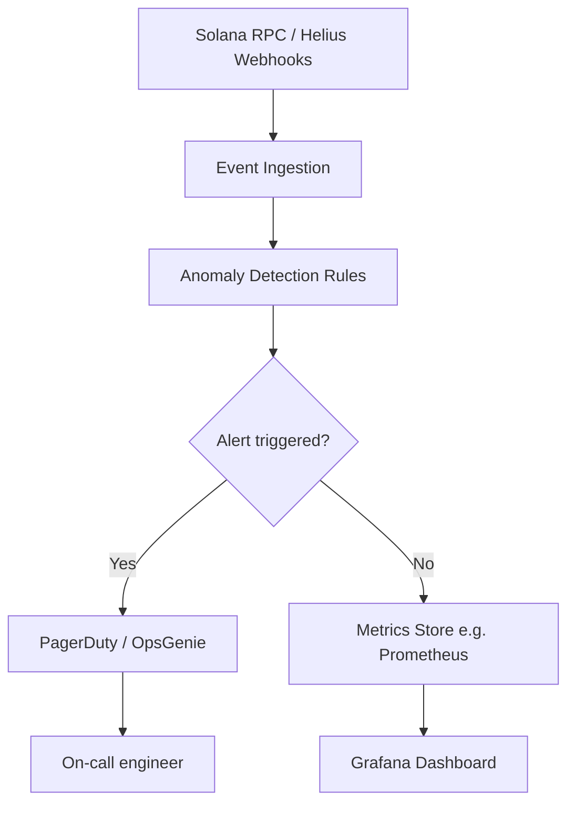

# Security

Security architecture for stablecoin payment systems on Solana. Covers key management, wallet security, operational security, payment security, threat modeling, and monitoring.

---

## Threat Model

Before designing security controls, understand your adversaries.

### Primary Threat Actors

| Actor | Capability | Primary Attack Vector | Primary Target |
|---|---|---|---|
| External attacker (advanced) | High | Supply chain, phishing, RPC manipulation | Hot wallet private keys |
| External attacker (opportunistic) | Medium | API vulnerabilities, brute force | Platform accounts, API keys |
| Insider threat | Medium-High | Direct access, social engineering | Treasury keys, admin access |
| Nation-state / sanctioned actor | High | Sophisticated phishing, social engineering | High-value treasury |
| Smart contract exploiter | High | Program vulnerability, logic bug | On-chain escrow/vaults |

### Asset Risk Matrix

| Asset | Compromise Impact | Likelihood | Priority |
|---|---|---|---|
| Cold treasury private keys | Catastrophic | Low | Critical |
| Hot wallet private keys | Severe | Medium | Critical |
| API signing keys | Severe | Medium-High | High |
| Database access | High | Medium | High |
| RPC endpoints | Medium | Medium | High |
| Webhook secrets | Medium | Medium | Medium |
| Customer PII | High | Medium | High |

---

## Key Management Architecture

### The Cardinal Rules

1. **Never store private keys in plaintext** — not in code, not in environment files, not in git, not in logs
2. **Never generate hot wallet keys on a general-purpose web server** — use an HSM or dedicated key service
3. **Hardware wallets for all cold treasury signers** — no exceptions
4. **Rotate operational keys quarterly** — hot wallet sweep keys, API signing keys, webhook secrets
5. **Key compromise must be detectable** — audit every key usage event

### Key Storage by Tier

| Key Type | Storage Method | Access Pattern |
|---|---|---|
| Cold treasury signers | Hardware wallet (Ledger Nano X) | Monthly, offline ceremony |
| Warm multisig signers | Hardware wallet | Weekly, require physical presence |
| Hot wallet / sweep key | AWS KMS or Google Cloud KMS | Automated, via SDK |
| API signing keys | HashiCorp Vault or AWS Secrets Manager | Service-to-service, rotated quarterly |
| Webhook secrets | Secrets Manager | Per-merchant, rotated on request |
| Database credentials | Secrets Manager | Application layer, auto-rotated |

### HSM Integration for Hot Wallet

Your hot wallet signing key should never exist as a raw private key file on a server. Use an HSM-backed key:



**KMS approach**: Store only the encrypted private key in KMS. The plaintext key never leaves the HSM boundary. Your application requests signing operations, not key material.

**Alternative**: Use MPC (Multi-Party Computation) signing via Fireblocks, Fordefi, or a self-hosted MPC solution. MPC eliminates the single-point key entirely.

---

## Wallet Security Architecture

### Hot Wallet Protection



**Hot wallet hard controls:**
- **Spending limit**: Configurable daily USDC transfer limit hardcoded in your signing service
- **Destination allowlist**: Hot wallet can only send to pre-approved addresses (warm wallet, merchant payout wallets)
- **Amount ceiling**: Single transaction cannot exceed X USDC without Squads multisig approval
- **Velocity circuit breaker**: If > Y transactions in 10 minutes, pause all signing and alert

### Multisig Security (Squads)

Squads multisig security practices:

- Store Squads vault address in your monitoring system — alert on any transaction from the vault
- Set a time lock on large transactions (Squads supports configurable execution delays)
- Use hardware wallets for all Squads signers — never software wallets for warm/cold multisig
- Conduct a quarterly "key attestation" — each signer verifies they still control their signing device
- Run a tabletop exercise annually simulating: "One signer is unavailable — can we still operate?"

---

## API Security

### Authentication

| Method | Use Case | Security Level |
|---|---|---|
| API Keys (secret header) | Server-to-server | Medium — keys can leak |
| JWT (signed tokens) | Frontend-to-backend | Medium — requires expiry |
| mTLS (mutual TLS) | High-trust service-to-service | High |
| OAuth 2.0 | Third-party integrations | High |

**API key requirements:**
- Minimum 32 bytes of cryptographic randomness
- Stored as a bcrypt hash in your database (never in plaintext)
- Support key rotation without service interruption (allow 2 active keys per merchant during rotation window)
- Scope keys: read-only vs. read-write vs. admin

### Webhook Security

Outbound webhooks (your platform → merchant's server) are a significant attack surface.

**Signing outbound webhooks:**
```
HMAC-SHA256 signature:
  key = merchant_webhook_secret (32+ random bytes)
  payload = raw request body (UTF-8 bytes)
  signature = HMAC-SHA256(key, payload)
  header = X-Signature: sha256=<hex_signature>
```

**Merchant verification instructions** (include in your docs):
```
1. Receive webhook POST request
2. Extract X-Signature header
3. Compute HMAC-SHA256 of raw request body using your webhook secret
4. Compare your computed signature to X-Signature (constant-time comparison)
5. Reject requests where signatures do not match
6. Reject requests where timestamp (X-Timestamp header) is > 5 minutes old
```

### Replay Attack Prevention

Every webhook and API request should include a timestamp. Reject requests with timestamps more than 5 minutes in the past or future. Store seen `Idempotency-Key` values for 24 hours to prevent replayed requests.

---

## Payment Security

### Transaction Verification

**Every payment must be independently verified on-chain.** Never accept a frontend-reported payment as confirmed.



**Every check is required.** If you skip the amount check, an attacker can send 0.001 USDC and your system may still confirm the order.

### Reference Key Security

Solana Pay reference keys are public — anyone can monitor for payments sent to a reference address. They do not provide security by themselves. Security comes from:

1. The reference key is single-use and expires with the session
2. Your backend independently validates the full transaction (amount, token, recipient)
3. The checkout session maps reference keys 1:1 to orders

### Front-Running and MEV Considerations

Solana's validators can observe pending transactions in the mempool. For standard USDC payments, this is generally not a concern — there is no profit in front-running a payment to a specific merchant.

However, for **escrow releases and large treasury operations**, consider:
- Using Jito bundles for time-sensitive or high-value transactions
- Splitting large operations across multiple blocks
- Avoiding predictable timing (e.g., always releasing escrow at midnight UTC — a detectable pattern)

---

## Operational Security (OpSec)

### Access Controls

| System | Principle | Implementation |
|---|---|---|
| Production database | Need-to-know only | No shared credentials; individual IAM roles |
| RPC endpoints | IP allowlist | Only your server IPs; no public exposure |
| Treasury signing | Dual authorization | Squads multisig; no single signer can act alone |
| Admin panel | MFA required | TOTP or hardware key (YubiKey) |
| Cloud infrastructure | Least privilege IAM | Role-based; no wildcard policies |

### Separation of Duties

No single person should be able to:
- Create a payment AND approve the corresponding payout
- Configure a webhook destination AND approve webhook secrets
- Access hot wallet keys AND approve treasury transfers

### Incident Response Plan

Define before you launch:

```
Severity Levels:
  P0 — Active funds theft or imminent theft risk
  P1 — Security breach detected, funds at risk
  P2 — Security vulnerability discovered, not yet exploited
  P3 — Suspicious activity, investigation required

P0 Response Protocol:
  1. Immediately pause all hot wallet signing (circuit breaker)
  2. Alert all Squads signers — do not act on any treasury transactions
  3. Change all API keys and rotate webhook secrets
  4. Engage security incident response firm (have one on retainer)
  5. Preserve all logs — do not delete anything
  6. Notify legal counsel
  7. Assess scope of breach
  8. Do NOT post publicly until scope is known
```

---

## Monitoring and Alerting

### Critical Alerts (Page immediately)

| Alert | Trigger |
|---|---|
| Large hot wallet outflow | Single transfer > $X within 1 minute |
| Hot wallet balance drop | Balance drops > 30% in 10 minutes |
| Multiple failed signing attempts | > 5 consecutive failures |
| Unknown destination transaction | Transfer to address not in allowlist |
| Treasury transaction | Any Squads multisig transaction initiated |
| Admin login from new IP | First-time IP for any admin user |

### Monitoring Stack



**Key on-chain events to monitor:**
- All transactions involving your hot wallet address
- All transactions involving Squads vault addresses
- All transactions involving merchant PDA addresses (unusual large transfers)
- Any transaction where your escrow program is invoked (but not by your backend)

### Security Logging Requirements

Log these events permanently (never delete security logs):
- Every signing operation (key ID, amount, destination, timestamp, result)
- Every admin login attempt (success and failure)
- Every API key creation, use, and revocation
- Every webhook delivery attempt and response code
- Every failed transaction and error code
- Every reconciliation discrepancy

Store logs in a write-once, append-only log store (AWS CloudWatch, Datadog, or equivalent). Logs must be retained for at least 5 years for financial regulatory purposes.

See `treasury-management.md` for wallet topology and `architecture-review.md` for security review framework.
