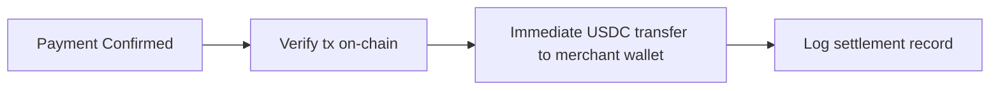
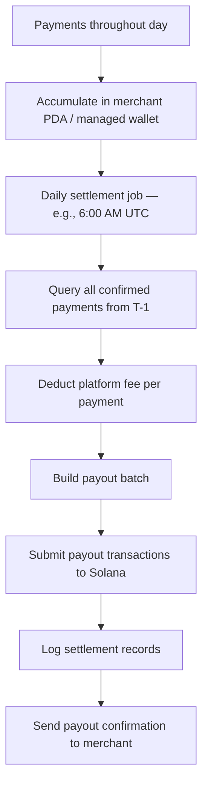
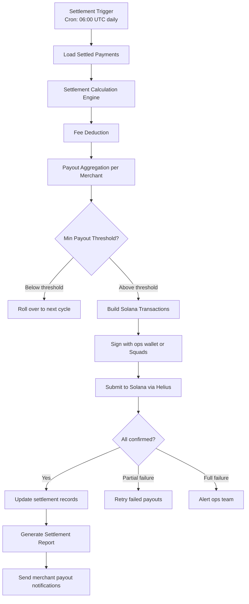
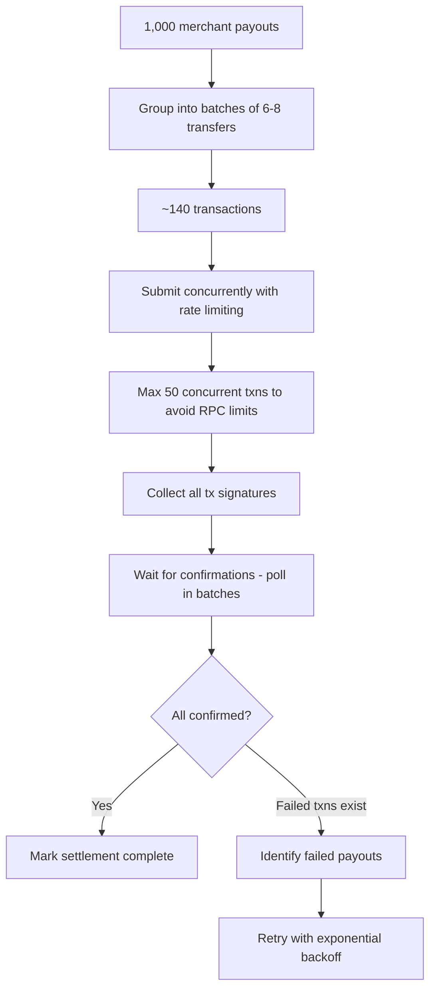
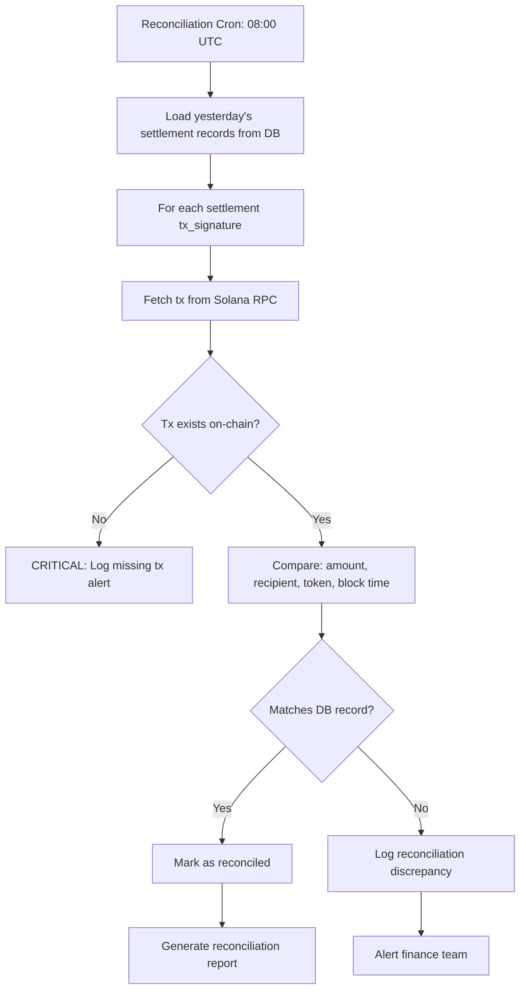
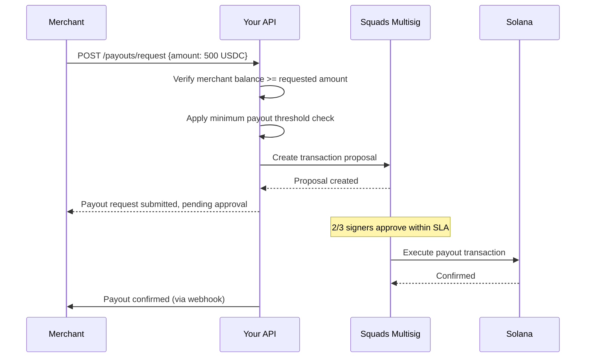

# Settlement Systems

Batch settlement pipelines, payout architecture, reconciliation, and ledger design for stablecoin payment platforms on Solana.

---

## What Settlement Means in This Context

Settlement is the process of moving funds from your platform's holding wallets to their final destinations:

- **Merchant payouts**: Sending sellers/merchants what they earned
- **Treasury sweeps**: Moving surplus from hot wallets to cold reserves
- **Partner disbursements**: Revenue shares, referral payouts, affiliate fees
- **Fee collection**: Moving platform fees to your treasury

Settlement is distinct from payment confirmation. Payment confirmation happens in ~400ms on Solana. Settlement is a deliberate, scheduled, policy-driven process that happens after confirmation.

---

## Settlement Models

### T+0 (Real-Time Settlement)

Funds are released to the merchant immediately after on-chain confirmation.



| Attribute | Value |
|---|---|
| Merchant experience | Best |
| Platform liquidity risk | High |
| Fraud/chargeback protection | None |
| Operational complexity | High |
| Recommended for | Established merchants, low fraud risk |

**Warning**: Real-time settlement eliminates your ability to hold funds for dispute resolution. Reserve this for whitelisted, trusted merchants with a track record.

---

### T+1 / T+2 Batch Settlement (Recommended Default)

Funds are held for 24-48 hours before being released in a daily batch.



| Attribute | Value |
|---|---|
| Merchant experience | Good |
| Platform liquidity risk | Low |
| Dispute window | 24-48h |
| Operational complexity | Medium |
| Recommended for | Most platforms |

---

### Weekly Settlement

Funds are batched and released weekly (common for marketplaces).

| Attribute | Value |
|---|---|
| Merchant experience | Acceptable |
| Platform liquidity risk | Very Low |
| Float opportunity | High (yield on 7-day float) |
| Compliance consideration | May trigger money transmitter questions |
| Recommended for | Freelance platforms, marketplace with dispute risk |

---

## Settlement Pipeline Architecture

### Full Pipeline (Production)



---

## Fee Calculation Architecture

### Platform Fee Models

| Model | Calculation | Best For |
|---|---|---|
| Flat percentage | `payout = amount × (1 - fee_rate)` | Simple marketplaces |
| Flat fee per transaction | `payout = amount - flat_fee` | High-volume, low-value |
| Tiered by volume | Rate decreases at volume thresholds | Large merchants |
| Subscription model | Fixed monthly fee, no per-tx fee | SaaS-style platforms |

### Fee Calculation Schema

```
settlement_calculations {
  id:                UUID
  merchant_id:       reference to merchants
  period_start:      timestamp
  period_end:        timestamp
  gross_volume:      decimal   -- total payments received
  transaction_count: integer
  platform_fee:      decimal   -- what platform keeps
  fee_rate:          decimal   -- rate applied
  refund_amount:     decimal   -- total refunds issued in period
  net_payout:        decimal   -- gross - fees - refunds
  payout_tx_signature: string nullable
  status:            enum [calculating, pending, processing, completed, failed]
  created_at:        timestamp
}
```

### Fee Precision

- Store all amounts as integers in the smallest unit (e.g., USDC has 6 decimal places; store amounts in micro-USDC)
- Never use floating point arithmetic for financial calculations
- USDC: `1 USDC = 1,000,000 micro-USDC`
- Rounding rule: Round fees in favor of the merchant (floor, not round)

---

## Batch Transaction Architecture

Solana supports batching multiple transfers in a single transaction, but there are limits.

### Transaction Limits

| Limit | Value |
|---|---|
| Max transaction size | 1,232 bytes |
| Max accounts per transaction | ~35 (varies by instruction complexity) |
| Practical SPL Token transfers per tx | 4-8 (depends on accounts) |
| Compute budget per transaction | 1,400,000 CUs |

**Practical implication**: For a 1,000 merchant payout batch, you need approximately 150-250 Solana transactions. At 0.000005 SOL per signature, this is negligible cost but requires careful sequencing.

### Payout Batching Strategy



### Rate Limiting

Helius free tier: 50 RPS | Growth: 200 RPS | Business: 500 RPS

When submitting large batches:
- Implement a token bucket rate limiter in your batch processor
- Add jitter to retry delays to avoid thundering herd
- Monitor RPC error rates — `429 Too Many Requests` errors indicate you need to slow down or upgrade RPC tier

---

## Reconciliation Architecture

Reconciliation proves that your off-chain ledger matches the on-chain state. It is not optional.

### Daily Reconciliation Job



### Reconciliation Report Schema

```
reconciliation_reports {
  id:                       UUID
  period_date:              date
  total_payments:           integer
  total_payment_volume:     decimal
  total_settlements:        integer
  total_settlement_volume:  decimal
  reconciled_count:         integer
  discrepancy_count:        integer
  missing_tx_count:         integer
  discrepancy_amount:       decimal
  status:                   enum [clean, discrepancies_found, pending_review]
  generated_at:             timestamp
  reviewed_by:              string nullable
  reviewed_at:              timestamp nullable
}
```

### Reconciliation Discrepancy Types

| Type | Severity | Likely Cause |
|---|---|---|
| Missing on-chain tx | Critical | Tx dropped, DB recorded prematurely |
| Amount mismatch | Critical | Rounding error, fee miscalculation |
| Wrong recipient | Critical | Address resolution bug |
| Timing mismatch | Low | RPC confirmation lag |
| Duplicate entry | Medium | Idempotency failure |

---

## On-Demand Payouts (Merchant Pull)

Some platforms allow merchants to initiate payouts on demand rather than waiting for the batch schedule.

### On-Demand Payout Flow



**On-demand payout considerations:**
- Set a minimum payout amount (e.g., $10 USDC) to prevent fee-inefficient micro-payouts
- Limit on-demand payouts per merchant per day to manage operational load on signers
- For fully automated on-demand payouts, use the hot wallet with sweep controls rather than Squads

---

## Settlement Failure Handling

| Failure Scenario | Detection | Recovery |
|---|---|---|
| Tx dropped by network | No confirmation after 60s | Resubmit with same signature (blockhash expired — rebuild tx) |
| Insufficient SOL for fees | `InsufficientFunds` error | Alert ops; fund fee wallet immediately |
| Invalid recipient ATA | `AccountNotFound` error | Create ATA first, then retry transfer |
| RPC timeout | No response within 30s | Switch to secondary RPC, resubmit |
| Merchant wallet frozen | Token account frozen | Alert ops, escalate to issuer (Circle/PayPal) |

**Critical**: Token account freezes (USDC, PYUSD, EURC all have freeze authority) can block payouts to a specific merchant. Always check if a recipient account is frozen before batching, and handle frozen accounts separately from your main batch.

See `treasury-management.md` for wallet architecture and `security.md` for signing key management.
