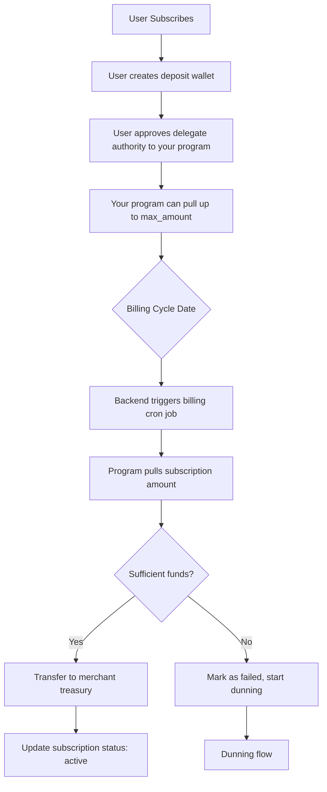
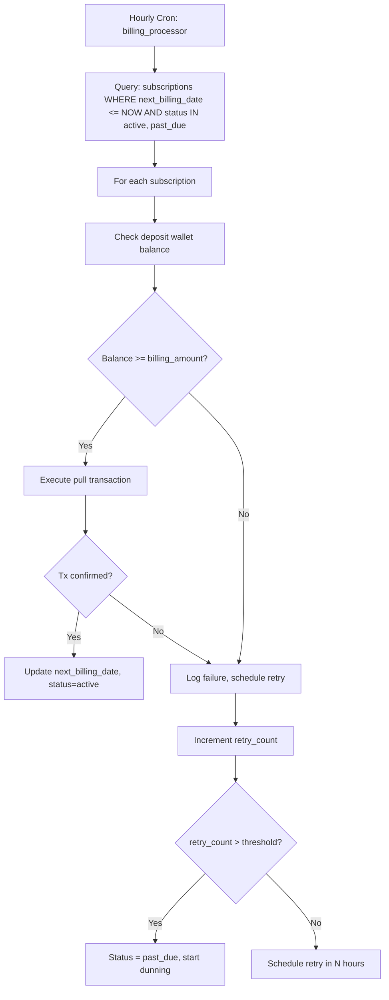
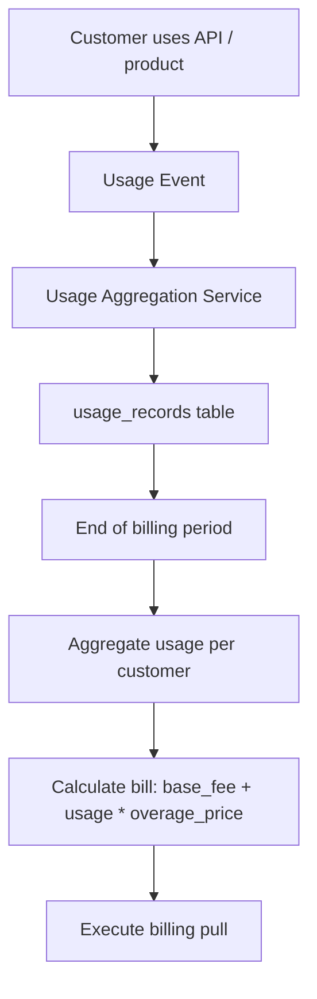
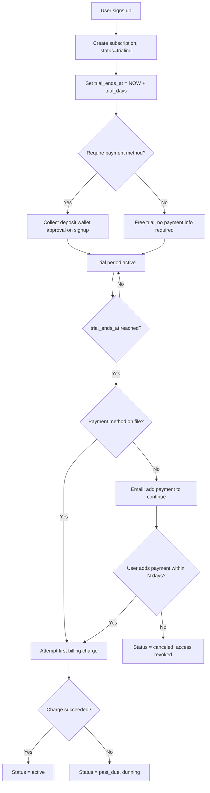

# Subscription Billing Systems

Recurring billing architecture for Solana stablecoin payments. Covers SaaS subscriptions, usage-based billing, trial management, and failed payment recovery.

---

## The Core Challenge

Solana has no native recurring payment primitive. There is no "approve recurring charge" mechanism in the base protocol. Every subscription payment must be an active, user-approved transaction — or you must hold custody of funds.

This means subscription billing on Solana requires one of three architectural approaches:

| Approach | Mechanism | Custody | UX | Compliance Risk |
|---|---|---|---|---|
| **Pull with pre-authorization** | User pre-authorizes your program to pull from a deposit | Partial custody | Best | Medium |
| **Push-only** | User must initiate each payment manually or via wallet automation | None | Worst | Low |
| **Full custodial** | User deposits funds; you deduct as needed | Full custody | Good | High (MSB risk) |

---

## Recommended Architecture: Pre-authorized Pull Billing

The most practical production architecture for SaaS subscriptions on Solana.

### How It Works

1. On signup, the user approves a delegate authority on a dedicated deposit account
2. Your program holds delegate authority to transfer funds up to a defined limit
3. On billing date, your backend calls your on-chain program which pulls the subscription amount
4. If the pull fails (insufficient funds), trigger your retry/dunning flow



### Token Account Delegate Authority

The Token-2022 and SPL Token programs support `approve()` — this sets a delegate authority and an approved amount on a token account. Your program, when set as delegate, can call `transfer()` up to the approved amount without further user interaction.

**Key constraints:**
- The user must have approved your program as delegate
- The approval has an `amount` ceiling — if the subscription is $99/month, the user needs to have approved at least $99
- You cannot pull more than the approved amount in a single instruction
- The user can revoke delegation at any time

**Practical UX:**
- On the billing page, show the user a one-time transaction to "enable auto-billing"
- This transaction: creates a deposit ATA if needed, deposits an amount, and approves your program as delegate
- Optionally implement a top-up mechanism (notify when deposit is low)

---

## Subscription Data Model

```
subscriptions {
  id:                 UUID
  customer_id:        reference to customers
  plan_id:            reference to plans
  status:             enum [trialing, active, past_due, canceled, paused]
  deposit_wallet:     solana address (customer's pre-auth deposit account)
  current_period_start: timestamp
  current_period_end:   timestamp
  billing_amount:     decimal (e.g., 99.00)
  token_mint:         string (USDC mint)
  trial_ends_at:      timestamp nullable
  cancel_at_period_end: boolean
  canceled_at:        timestamp nullable
  next_billing_date:  timestamp
  created_at:         timestamp
}

plans {
  id:             UUID
  name:           string
  billing_interval: enum [monthly, annual, weekly]
  base_price:     decimal
  usage_included: integer nullable (for usage-based)
  overage_price:  decimal nullable (per unit above included)
  features:       jsonb
  trial_days:     integer default 0
}

billing_events {
  id:              UUID
  subscription_id: reference to subscriptions
  event_type:      enum [charge, refund, trial_start, trial_end, upgrade, downgrade, cancel]
  amount:          decimal
  tx_signature:    string nullable (on-chain confirmation)
  status:          enum [pending, succeeded, failed]
  failure_reason:  string nullable
  created_at:      timestamp
}
```

---

## Billing Cycle Architecture

### Billing Cron Job

Run a billing job every hour (not daily — you want to catch retries and edge cases):



### Retry Schedule (Dunning)

```
Attempt 1: Immediately on billing date
Attempt 2: 24 hours later
Attempt 3: 72 hours later (3 days)
Attempt 4: 7 days later
Final:      14 days — mark as canceled, suspend access
```

Send notifications at each attempt. Email is the minimum; in-app notification is better.

---

## Usage-Based Billing

Usage-based billing (metered billing) charges based on consumption rather than a flat rate.

### Architecture



### Usage Tracking Schema

```
usage_records {
  id:              UUID
  customer_id:     reference to customers
  subscription_id: reference to subscriptions
  event_type:      string (e.g., "api_call", "storage_gb", "seat")
  quantity:        decimal
  unit_price:      decimal nullable (if price varies by event)
  recorded_at:     timestamp
  billing_period:  string (e.g., "2026-06")
}

usage_summaries {
  id:              UUID
  customer_id:     reference to customers
  subscription_id: reference to subscriptions
  billing_period:  string
  total_quantity:  decimal
  included_units:  decimal
  overage_units:   decimal
  overage_amount:  decimal
  base_amount:     decimal
  total_billed:    decimal
  billed_at:       timestamp nullable
  tx_signature:    string nullable
}
```

### Aggregation Strategy

- Record raw usage events in real-time (do not discard them)
- Aggregate hourly into usage_summaries for dashboards
- Final aggregation at billing period end is the source of truth for billing
- Keep raw events for at least 90 days for dispute resolution

---

## Trial Period Architecture



**Design decision**: Requiring payment info at trial start significantly increases trial-to-paid conversion but creates friction at signup. Evaluate based on your product's self-evident value. If users need to experience value before committing, defer payment collection.

---

## Subscription Plan Changes (Upgrades/Downgrades)

### Upgrade (Mid-Cycle)

When a customer upgrades mid-billing-period:

**Proration approach (recommended):**
1. Calculate unused portion of current period
2. Apply credit toward the new plan
3. Charge the prorated difference immediately
4. Start new plan immediately

**Simplified approach:**
1. Apply upgrade at the next billing date
2. No proration — next charge is at the new plan price

Proration is better UX but significantly more complex to implement correctly. For v1, the simplified approach is acceptable.

### Downgrade (Mid-Cycle)

When a customer downgrades:
1. Keep current plan active until end of period (they paid for it)
2. Switch to new plan at next billing date
3. Do not issue partial refunds unless your policy explicitly allows it
4. Record the pending downgrade as `cancel_at_period_end = true` + `pending_plan_id`

---

## Annual Subscriptions

Annual billing is common for SaaS. Key differences from monthly:

- Billing is one large payment per year (e.g., $990 instead of 12 × $99)
- The deposit wallet must hold the full annual amount or be topped up
- Cancellation requires a refund policy (pro-rata is standard)
- Renewal reminders should go out 30, 14, and 7 days before billing date

**Pro-rata refund on annual cancel:**
```
refund_amount = annual_price × (months_remaining / 12)
```

Round down months_remaining. Do not refund the current month.

---

## Subscription Security Considerations

- **Delegate authority revocation**: Monitor for users who revoke your delegate authority without canceling their subscription. This is a billing failure, not a cancellation — treat it as `past_due`.
- **Deposit wallet drains**: If a user's deposit wallet is emptied externally, your billing pull will fail. This is expected — handle via dunning, not as fraud.
- **Double billing prevention**: Use idempotency keys on all billing transactions. A billing job crash-restart must not result in duplicate charges.
- **Audit log**: Every subscription state change must be logged with actor (user/system), timestamp, and reason.

See `security.md` for operational security controls and `treasury-management.md` for where subscription revenue should flow.
