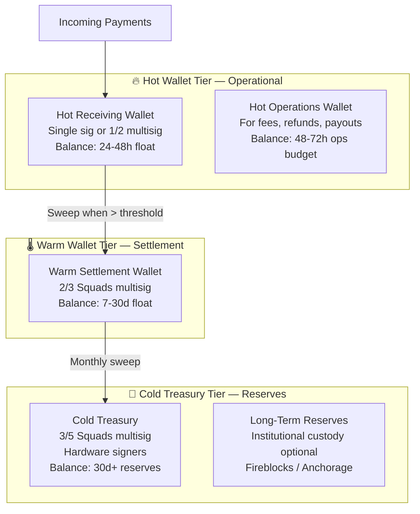
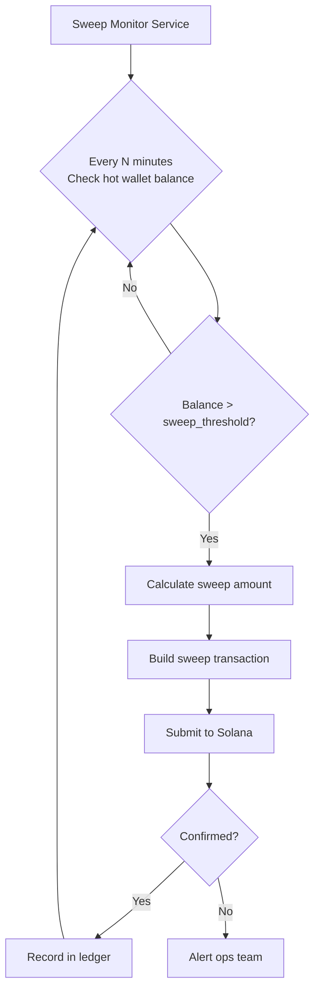

# Treasury Management

Hot, warm, and cold wallet architecture for stablecoin treasury operations on Solana. Covers wallet topology, multi-signature setup, treasury operations, sweep policies, and institutional custody considerations.

---

## Treasury Architecture Principles

A stablecoin treasury is not just a wallet. It is a set of operational policies, wallet structures, authorization controls, and monitoring systems that together protect your liquid assets.

**The three failure modes treasury design prevents:**
1. **Key compromise** — A single stolen private key drains your treasury
2. **Operational error** — A misconfigured transaction sends funds to the wrong address
3. **Insider threat** — A single authorized person can unilaterally move funds

Sound treasury design requires multi-signature authorization for any significant fund movement.

---

## Wallet Topology

### Standard Three-Tier Model



### Balance Targets by Tier

| Tier | Balance Target | Rationale |
|---|---|---|
| Hot receiving | 24-48h of expected inflows | Minimize exposure; sweep frequently |
| Hot operations | 48-72h of expected outflows | Fund refunds, fees, payouts |
| Warm settlement | 7-30d float | Buffer for weekly payout cycles |
| Cold treasury | >30d reserves | Protection against operational disruption |
| Institutional | >$5M long-term holdings | Insurance, regulatory compliance |

---

## Multi-Signature Setup with Squads Protocol

**Squads Protocol v4** is the production standard for multi-signature treasury management on Solana. It is audited, actively maintained, and widely used by Solana-native businesses.

### Recommended Squads Configurations

| Tier | Threshold | Members | Rationale |
|---|---|---|---|
| Hot (internal ops) | 1 of 2 | Ops Engineer + CTO | Fast for operational transactions |
| Warm (settlement) | 2 of 3 | CTO + CFO + Ops Lead | Balance speed and security |
| Cold (reserves) | 3 of 5 | Board/Leadership team | Maximum security, infrequent access |
| Emergency access | 4 of 5 | Full leadership | Break-glass for compromise scenarios |

### Signer Diversity Requirements

**Never** have all signers share:
- The same device
- The same location
- The same organization (for external members)

**Hardware wallet requirement**: Cold treasury signers must use hardware wallets (Ledger Nano X or similar). Software wallets are not acceptable for cold treasury signing.

### Key Signer Roles

```
Treasury Structure:
├── Hot Wallet (software key, server-side HSM)
│   └── Used by: automated sweep jobs, refund processor
├── Warm Multisig (2/3 Squads)
│   ├── Signer 1: CTO — Ledger hardware wallet
│   ├── Signer 2: CFO — Ledger hardware wallet
│   └── Signer 3: Operations Lead — Ledger hardware wallet
└── Cold Multisig (3/5 Squads)
    ├── Signer 1: CEO — Ledger (offline)
    ├── Signer 2: CTO — Ledger (offline)
    ├── Signer 3: CFO — Ledger (offline)
    ├── Signer 4: External counsel / trustee
    └── Signer 5: Institutional custodian
```

---

## Sweep Policies

### Automated Sweep Architecture



### Sweep Thresholds (Example — Adjust for Your Volume)

| Volume Tier | Hot Balance Ceiling | Sweep Frequency |
|---|---|---|
| < $100K/month | $10,000 | Daily |
| $100K–$1M/month | $50,000 | Every 4 hours |
| $1M–$10M/month | $100,000 | Every hour |
| > $10M/month | $250,000 | Every 15 minutes |

**Sweep target**: Always sweep to warm wallet, not cold. Cold treasury is accessed monthly at most.

### Sweep Transaction Security

- Sweep destination must be hardcoded in your sweep service configuration, not taken from a database or API parameter
- Sweep service signing key must be stored in an HSM or secrets manager (AWS KMS, Google Cloud KMS, HashiCorp Vault)
- Sweep transactions must be logged with pre-balance, post-balance, amount, and destination
- Any sweep above your configured `large_transaction_threshold` should alert the operations team before executing

---

## Treasury Operations Procedures

### Daily Operations

| Task | Responsible | Frequency |
|---|---|---|
| Verify hot wallet sweep completed | Automated + Ops alert | Daily |
| Check hot wallet balance vs. expected | Ops Engineer | Daily |
| Review failed transaction log | Ops Engineer | Daily |
| Reconcile ledger vs. on-chain balance | Automated + Finance | Daily |

### Weekly Operations

| Task | Responsible | Frequency |
|---|---|---|
| Review warm wallet balance | CFO + CTO | Weekly |
| Authorize merchant payout batch | 2 of 3 Squads signers | Weekly |
| Review large transaction report | CFO | Weekly |
| Security log review | Security Lead | Weekly |

### Monthly Operations

| Task | Responsible | Frequency |
|---|---|---|
| Cold treasury balance review | Leadership team | Monthly |
| Authorize cold sweep (if needed) | 3 of 5 Squads signers | Monthly |
| Treasury report to board | CFO | Monthly |
| Signer key attestation | All signers | Monthly |
| Disaster recovery drill | CTO + Ops | Quarterly |

---

## Float Management

### What Is Float?

Float is the time gap between when you receive a customer payment and when you pay out to merchants/sellers. During this window, you hold the funds. Float management is about optimizing this period and ensuring you always have enough liquidity to cover payouts.

### Float Calculation

```
float_requirement = (average_daily_payouts × payout_lag_days) + (refund_reserve_rate × monthly_volume)

Example:
  average_daily_payouts:  $50,000
  payout_lag_days:        2 (T+2 settlement)
  refund_reserve_rate:    2%
  monthly_volume:         $1,500,000

  float = ($50,000 × 2) + (0.02 × $1,500,000)
  float = $100,000 + $30,000
  float = $130,000 required minimum float
```

Maintain 1.5× to 2× the calculated minimum float as a buffer.

### Yield on Float

Stablecoin float can be put to work through DeFi yield strategies. This is an operational decision with risk implications:

| Strategy | Approximate APY | Risk Level | Liquidity |
|---|---|---|---|
| Hold in treasury (no yield) | 0% | None | Instant |
| Kamino Finance (conservative) | 3-6% | Low | Hours |
| Jupiter DCA into yield vaults | 4-8% | Low-Medium | Hours-Days |
| Marginfi lending | 4-7% | Low-Medium | Hours |

**Important**: Any DeFi strategy introduces smart contract risk and liquidity timing risk. Only deploy yield strategies on float that is not needed for imminent payouts. Keep at least 2× expected payout for the next 48 hours in immediately accessible wallets. Discuss with your legal counsel whether yield on customer float triggers additional regulatory obligations.

---

## Stablecoin Redemption Planning

Your treasury holds stablecoins. You need a clear path to convert them to fiat if needed.

### USDC/EURC Redemption (Circle)

- Circle provides direct USDC → USD and EURC → EUR redemption via the Circle Account API
- Redemption requires a verified Circle business account
- Settlement is via bank wire (SWIFT or ACH)
- Minimum redemption: typically $1,000 USD equivalent
- Timing: Same day or next business day for amounts under $10M

### PYUSD Redemption (PayPal)

- PYUSD can be converted to USD via PayPal's platform
- Requires a verified PayPal business account
- Subject to PayPal's standard withdrawal limits and timing

### Emergency Liquidity

If you need fiat faster than Circle/PayPal redemption, OTC desks provide faster settlement:
- **Cumberland, Galaxy, B2C2** — institutional OTC for large volumes ($500K+)
- **Kraken, Coinbase Institutional** — exchange-based conversion

---

## Institutional Custody (When to Consider It)

Consider institutional custody (Fireblocks, Anchorage, Copper) when:

- Your cold treasury exceeds $5M USDC equivalent
- You have institutional investors who require auditable custody
- You are subject to financial regulations requiring qualified custody
- Your insurance requirements demand it

### Custody Provider Comparison

| Provider | Min Balance | Solana Support | Insurance | MPC/HSM |
|---|---|---|---|---|
| Fireblocks | $1M+ AUM | Yes (native) | Yes | MPC |
| Anchorage | $5M+ AUM | Yes | Yes | HSM |
| Copper | $1M+ AUM | Yes | Yes | MPC |
| Fordefi | $500K+ AUM | Yes | Yes | MPC |

Institutional custody adds cost (typically 5-15 bps annually on AUM) but provides insurance coverage, regulatory compliance, and audit trails that self-custody solutions cannot match.

See `security.md` for key management and wallet security details, and `settlement-systems.md` for how funds flow from treasury to merchant payouts.
